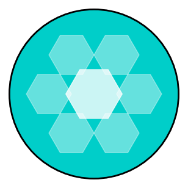

# BALLS! (v18)

A parametric 3D generator for spheres, capsules, and containers. Featuring "Deep Root" threaded connections, Snap-Latch hinges, and Smart Breakaway Supports.



## 🚀 Quick Start

### Windows (Easiest)
1. Download the installer (`Balls_Generator_Setup.exe`) from the **Releases** section.
2. Run the installer.
3. It will check for **Docker Desktop**. If you don't have it, it will prompt you to download it.
4. Double-click the **BALLS! Generator** icon on your desktop.

### Mac / Linux (Docker)
1. Install [Docker Desktop](https://www.docker.com/products/docker-desktop/).
2. Download and unzip the source code.
3. **Mac Users:** Right-click `launch_mac.command` -> **Open** (to bypass security once).
4. **Linux Users:** Run `sh run_mac_linux.sh` in the terminal.

### Python (Manual)
If you are a developer and prefer running without Docker:
```bash
pip install -r requirements.txt
python run_app.py
```

---

## ✨ Features
- **Hinge V7:** Butterfly bridge with outer-surface "Finger & Wedge" latch for reliable print-in-place articulation.
- **Threads V15:** Deep-embed logic guarantees solid boolean intersection, preventing "floating thread" printing errors.
- **Smart Supports:** Triangular contact points ensuring stability during printing but clean breakaway removal.
- **Pattern Engine:** Generates high-resolution 2D patterns (Hex, Circle, Spade) and mathematically folds them onto a sphere.

---

## 🛠️ Tech Stack & Credits

This project stands on the shoulders of giants. A huge thank you to the creators and maintainers of these open-source libraries:

*   **[Streamlit](https://streamlit.io/)**: The fastest way to build data apps in Python. Used for the entire user interface and visualization.
*   **[Trimesh](https://trimesh.org/)**: A pure Python library for loading and constructing 3D meshes. Used for all 3D geometry manipulation, constructive solid geometry (CSG), and export.
*   **[Shapely](https://shapely.readthedocs.io/)**: Manipulation and analysis of geometric objects in the Cartesian plane. Used for generating the high-precision 2D pattern sheets before folding.
*   **[Mapbox Earcut](https://github.com/mapbox/earcut.hpp)**: Fast polygon triangulation. Used to convert the 2D Shapely patterns into meshable surfaces.
*   **[NumPy](https://numpy.org/)**: The fundamental package for scientific computing with Python.
*   **[Plotly](https://plotly.com/)**: Used for the interactive 3D preview within the app.

---

## 📄 License

This project is licensed under the **MIT License** - see the [LICENSE](LICENSE) file for details.
Basically: You are free to use, modify, and distribute this software, provided you include the original copyright and license notice (Attribution).

---

**Generated by Gemini CLI**